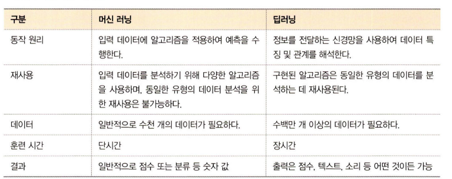

# 1장 머신러닝과 딥러닝

생성일: 2024년 9월 22일 오후 2:11
태그: Week 1

### 1-1 머신러닝과 딥러닝

- 인공 지능이란 인간의 지능을 모방하여 사람이 하는 일을 컴퓨터.가 할 수 있도록 하는 기술로 인공지능을 구현하는 방법으로 머신러닝과 딥러닝이 있음
- 인공지능>머신러닝>딥러닝
- 머신러닝은 주어진 데이터를 인간이 먼저 전처리 (이미지 데이터라면 사람이 학습 데이터를 컴퓨터가 인식할 수 있도록 준비해두어야 함. 데이터의 특징을 스스로 추출하지 못함.)
- 딥러닝은 인간이 하던 작업을 생략. 대량의 데이터를 신경망에 적용하면 컴퓨터가 스스로 분석

### 1-2 머신러닝이란

- 머신러닝은 인공지능의 한 분야로, 컴퓨터가 스스로 대용량 데이터에서 지식이나 패턴을 찾아 학습하고 예측을 수행하는 것.
- 머신러닝의 학습과정

- 이때 실제 데이터의 특징이 잘 반영되고 편향되지 않는 훈련 데이터를 확보하는 것이 중요
- 보통 데이터와 테스트 데이터의 분리 비율은 8:2
- [모델선택 → 모델 학습 및 평가 → 평가 바탕으로 모델 업데이트] 단계를 반복하면서 주어진 문제를 가장 잘 풀 수 있는 모델을 찾음

 

- 이때 훈련 데이터에 대한 정확도는 높은 반면 검증 데이터셋에 대한 정확도가 낮다면 훈련데이터셋에 과적합이 일어났을 가능성이 잇음. 이 경우 정규화나 에포크를 줄이는 방식으로 과적합을 막을 수 있음
- ❓ 정규화나 에포크를 줄이는 방식이 과적합을 줄이는 이유?
    - L1 정규화: 가중치의 절댓값 합을 손실함수에 추가하여 일부 가중치가 0이 되도록 유도. 모델을 더 단순하게 만듦
    - L2 정규화: 가중치의 제곱합을 손실함수에 축하여 모든 가중치가 너무 크지 않도록 제한. 모델이 특정한 데이터 포인트에 과도하게 적응하지 않도록 도움
    - 에포크(전체 데이터셋을 모델이 한번 학습하는 과정 의미)를 줄이면 모델이 데이터를 지나치게 반복해서 학습하는 것을 방지할 수 있음

### 1-3 딥러닝이란

- 인간의 신경망 원리를 모방한 심층 신경망 이론을 기반으로 고안된 머신러닝의 일종
- 인간의 신경망 (뉴련/시냅스) 에 착안하여 컴퓨터에 개념을 적용
- 딥러닝 모델의 학습과정

- 모델 정의 단계에서 신경망을 생성. 일반적으로 은닉층의 개수가 많을 수록 성능이 좋아지지만 과적합이 발생할 확률이 높아짐
- 모델 컴파일 단계에서 활성화 함수, 손실 함수, 옵티마이저를 선택함. 예를 들어 훈련 데이터셋이 연속형 형태라면 Mean Squared Error, 이진 분류라면 Cross Entropy를 사용함.
- 모델 훈련 단계에서 한번에 처리할 데이터의 양을 지정함. 전체 훈련 데이터셋에서 일정한 묶음으로 나누어 처리할 수 있는 배치와 훈련의 횟수인 에포크 선택이 중요함. 이때 훈련 과정에서 값의 변화를 시각적으로 표현하여 눈으로 확인해보면서 파리미터와 하이퍼파라미터에 대한 최적의 값을 찾을 수 있어야 함.

**[훈련 데이터셋 1000개에 대한 배치크기가 20이라고 가정]**

1. 샘플 단위 20개 마다 모델 가중치를 한번씩 업데이트 시킴. 따라서 총 50번의 가중치가 업데이트 됨
2. 이때 에포크가 10이라면, 가중치를 50번 업데이트를 10번 반복 → 총 500번 가중치 업데이트
- 딥러닝 학습과정에서 중요한 핵심 구성요소는 신경망(데이터셋의 어떤 특성이 중요한지 스스로 가르쳐 줄 수 있는 기능)과 역전파(가중치 값을 업데이트하기 위함. 미분을 통한 방법)

**딥러닝 학습 알고리즘**

1. **지도학습**
- cv에서 이미지 분류에 가장 많이 사용되는 기술 합성곱 신경망 Convolutional Neural Network, CNN → 목적에 따라 이미지분류, 이미지 인식, 이미지 분할로 분류 가능
- 시계열 데이터를 분류할 때 사용되는 것이 순환 신경망 Recurrent Neural Network, RNN → 하지만 이때 역전파 과정에서 기울기 소멸 문제 발생할 수 있음 → gate를 3개 추가 → LSTM Long Short-Term Memory (과거의 정보를 잊기 위한 망각 게이트, 현재 정보를 기억하기 위한 입력게이트, 최종결과를 위한 출력게이트)
1. **비지도 학습**
- Work Embedding: 자연어를 벡터로 표현. 이때 벡터화하는 기술로 Word2Vec과 GloVe 사용
- Clustering은 아무런 정보가 없는 상태에서 데이터를 분류하는 방법으로 머신러닝과 함께 사용되면 모델 성능을 높일 수있음
1. **전이학습 Transfer Learning**
- 사전 학습이 완료된 모델 pre-trained model로 우리가 원하는 학습에 미세 조정 기법을 이용하여 학습시키는 방법
- VGG, Inception, MobileNet과같은 사전 학습 모델을 사용

 

